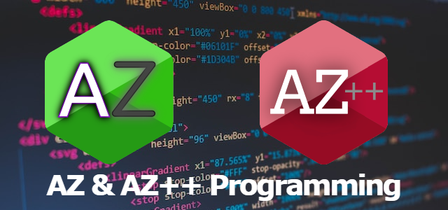
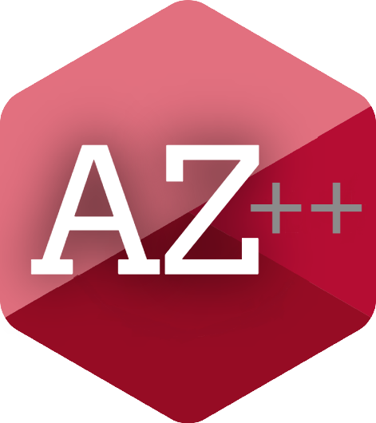

# AZ & AZ++ Programming Languages #

These are very new programming languages which we have created. Before we dive into these languages basics & instructions to use I like to give you some knowledge about these languages. `AZ` is one of these two languages which is `an interpreted language` & it will first to be completed(mature) & then it's friend friend `AZ++` will be the next. `AZ++ is a compiled language`.

- `AZ syntax` is like & as simple as `Python` & `JavaScript`.
- Many words & predefine terms(tokens) taken from python & JavaScript.
- AZ will be completed first & then we will focus on AZ++.
- In this repository you can find everything which is available for these languages.
- Here you can find different things in different branches: 
  - **main**: Documentation of these languages including their uses & basics & advance concepts. If you are finding documentations for modules, it can be found in the respective branch or repository of that module.
  - **AZ(immature)**: It's a branch with some bugs. Code in this branch is not tested properly yet & not mature. But yeah it's ahead of mature branches of this language like AZ-1.0, AZ-2.0, etc.
  - **AZ++(immature)**: It's same as `AZ(immature)` but it's for AZ++. it's also ahead of mature branches of this language like AZ++1.0, AZ++2.0, etc.
  - **AZ-1.0**: It's a branch with mature version of the AZ language. It contains `Version 1.0`.
  - **AZ++1.0**: It's a branch with mature version of AZ++ language. It contains `Version 1.0`.
  - **buggy**: It conatains some very buggy stuff & some new experimental features & experiments with code by the `team`. You should avoid using these code & visit this branch. It's just like an experiment lab.
  - **beautiful-stuff**: It countains some social preview stuff like icons & banners for uploading on social media platforms & forums.

# AZ #

It's an interpreted language & it's not a subset or superset of any other scripting language but inspired by many. In version 1.0 we have added very simple syntax format with basic data-types & data-structures.

- It's file name ends with the extension `.azlang`.
- It's an `interpreted language` so it will `not generate matchine code` as you know.
- It's `Version 1.0` will have no liberary support but we will release some with `Version 2.0` or either `Version 2.50`.
- `Module` can be used with the keyword `load`.

## *Its features:* ##

- ✨It's easy to learn.
- ❌It asks for too many dependencies.
- ❌It's boring.
- ✨It's open source.
- ✨It's very new.
- ✨It's syntax is easy.
- ✨It's bug free.
- ✨It's modules are bug free.

# AZ++ #

It's a compiled language which made with C & C++. It has taken some syntax from C++ but its not a superset. The author & the team of the language promise to make it's syntax easy, clear & readable. Actually it's itself a superset of `AZ` scripting language with more far data-Structures & a wide range of Data-Types.

- It's file name ends with the extension `.azpp`.
- It's a `compiled language & generates matchine code` with the same name as the source code.
- Same as AZ it's first version doesn't support any library & modules, but it's `Version 2.0` or `Version 2.5` & `above` does.
- Unlike AZ language its `module importing keyword` is `connect`.

## *It's features:* ##

- ✨It's easy to learn.
- ❌It asks for too many dependencies.
- ❌It's boring.
- ✨It's open source.
- ✨It's very new.
- ✨It's syntax is easy.
- ✨It's bug free.
- ❌Modules can be buggy sometimes.
